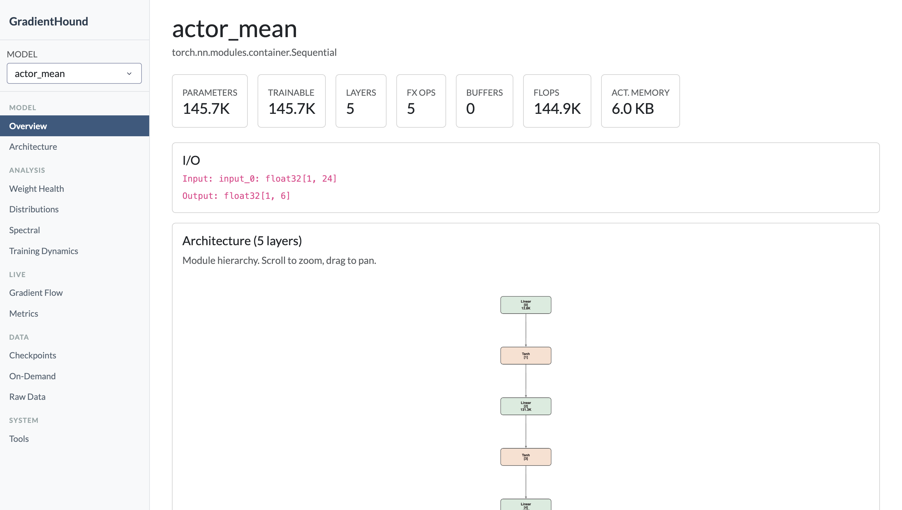
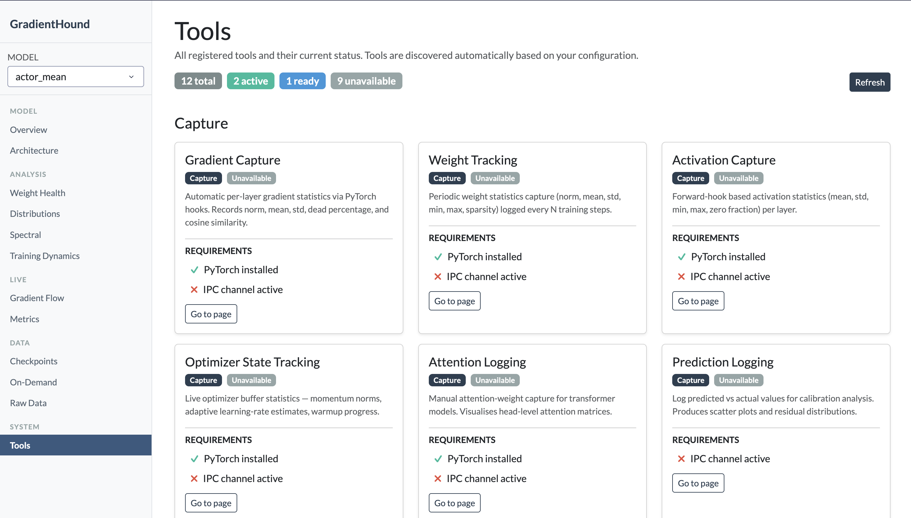
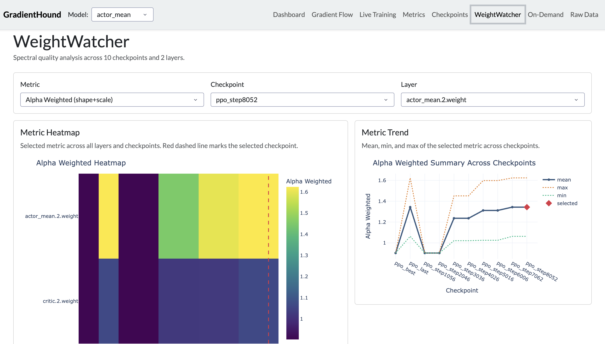
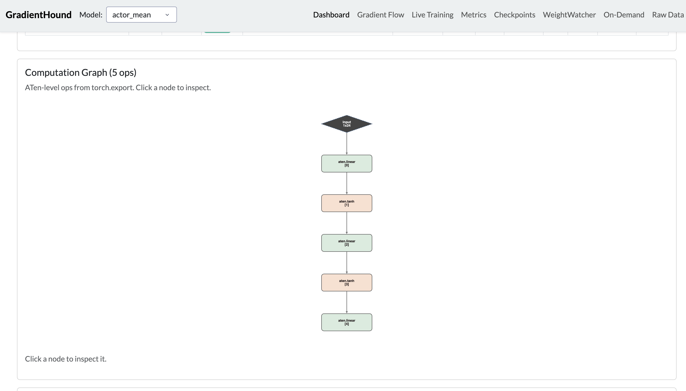

# GradientHound

> **Beta** — core functionality is stable; some rough edges remain. See [Known Limitations](#known-limitations).

<p align="center">
    
</p>

Post-training tooling to inspect PyTorch model architectures, gradients, weights, and optimizer state in real time. Drop a few lines into any training loop and get a live Dash dashboard showing gradient flow, weight health, spectral metrics, attention patterns, and more.

GradientHound integrates with weightwatcher, fvcore, torch-pruning, graphviz, and Cytoscape to provide a comprehensive view of model structure and training dynamics.

## Known Limitations

- **Framework assumptions** — the hook-based capture is tested primarily against standard PyTorch training loops. Custom autograd functions or compiled models (`torch.compile`) may require manual step calls.
- **`torch.export` coverage** — FX graph export falls back to module-tree-only for models with data-dependent control flow or unsupported ops.
- **Scale** — designed for research-scale models. Very large models (>1B parameters) may produce high-volume telemetry; use `weight_every` and `log_activations=False` to reduce write load.










## Install

```bash
pip install gradienthound            # core + model export
pip install gradienthound[torch]     # + PyTorch hooks
pip install gradienthound[dash]      # + standalone dashboard (Dash, Plotly, Cytoscape, wandb)
pip install gradienthound[spectral]  # + WeightWatcher-style spectral metrics (powerlaw)
pip install gradienthound[analysis]  # + FLOPs/pruning analysis (fvcore, torch-pruning)
pip install gradienthound[embeddings] # + t-SNE, UMAP, PCA layer embeddings (scikit-learn, umap-learn)
```

## Quick Start

```python
import torch, torch.nn as nn, gradienthound

model = nn.Sequential(nn.Conv2d(3, 32, 3, padding=1), nn.ReLU(),
                      nn.Flatten(), nn.Linear(32*32*32, 10))
optimizer = torch.optim.Adam(model.parameters(), lr=1e-3)

gradienthound.init(metadata={"lr": 1e-3, "batch_size": 32})
gradienthound.register_model("mymodel", model)
gradienthound.register_optimizer("adam", optimizer)
gradienthound.watch(model, name="mymodel")

for epoch in range(100):
    out = model(torch.randn(8, 3, 32, 32))
    loss = nn.functional.cross_entropy(out, torch.randint(0, 10, (8,)))
    optimizer.zero_grad(); loss.backward(); optimizer.step()
    gradienthound.step()

gradienthound.shutdown()
```

**With wandb:** call `gradienthound.capture_wandb()` after `init()` to auto-capture `wandb.log()` scalars.

## API

| Function | What it does |
|---|---|
| `init(metadata=None)` | Start a capture run. |
| `register_model(name, model)` | Register an `nn.Module` for architecture viz. |
| `register_optimizer(name, optimizer)` | Register an optimizer for state inspection. |
| `watch(model, name, log_gradients=True, log_activations=False, weight_every=50)` | Attach hooks for automatic gradient/activation capture. |
| `step(step=None)` | Flush buffered stats. Call once per training step. |
| `log_weights(name=None)` | Force an immediate weight snapshot. |
| `log_attention(name, weights)` | Log an attention matrix for heatmap viz. |
| `log_predictions(predicted, actual, name="default")` | Log predicted vs actual for calibration plots. |
| `capture_wandb()` | Monkey-patch `wandb.log()` to also feed GradientHound. |
| `shutdown()` | Clean up hooks and close the run. |
| `export_model(model, example_inputs, output, ...)` | Export model graph to `.gh.json` for offline viewing. |

## Standalone Dashboard

```bash
python -m gradienthound --model model.gh.json                     # exported model
python -m gradienthound --model ./exports/                        # search directory for .gh.json
python -m gradienthound --checkpoints ckpt1.pt ckpt2.pt ckpt3.pt  # checkpoint comparison
python -m gradienthound --checkpoints ./checkpoints/              # search directory for .pt/.pth/.ckpt
python -m gradienthound --port 9000 --debug                       # custom port + hot-reload
```

Combine flags freely: `--model`, `--checkpoints`, `--wandb-entity`/`--wandb-project-run-id`.

## Dashboard Pages

### Dashboard (main page)

Model overview: stat cards (params, FLOPs, activation memory, checkpoint count, health counts), I/O summary, and live analysis sections (FLOPs breakdown, activation memory per module) when available.

When checkpoints are loaded, the dashboard shows all analysis sections below.

### Architecture

Interactive Cytoscape.js graph of the module hierarchy. Nodes colored by type (conv, linear, norm, activation, pool, dropout, embedding). When checkpoints are loaded, nodes are health-colored (healthy/warning/critical) based on weight statistics. Click any node to see per-parameter details with mini histogram and SVD plots.

Full ATen-level FX computation graph shown when `torch.export` data is available.

### Checkpoints

Select and process checkpoint files with wildcard filtering. Displays optimizer state cards and spectral summary.

### WeightWatcher

Deep spectral analysis: global metric views (alpha, mp_softrank, etc.), heatmaps across layers and checkpoints, per-layer ESD plots. Requires the `powerlaw` package.

### Gradient Flow

Gradient norm evolution across layers over training steps, cosine similarity between gradient steps, update ratios, dead neuron detection.

### Metrics

Time-series charts for scalars logged via wandb or directly.

### Embeddings

t-SNE, UMAP, and PCA projections of per-layer weight statistics. Each layer becomes a point in 2D; proximity means similar weight characteristics (norm, kurtosis, effective rank, etc.). With multiple checkpoints, arrows trace each layer's trajectory through training. Controls for method, perplexity/neighbors, and coloring by checkpoint, layer type, or depth. PCA works with no extra dependencies; t-SNE requires `scikit-learn`, UMAP requires `umap-learn`.

### Tools

Status dashboard showing all available capture, analysis, on-demand, and integration tools with their dependency status and links to relevant pages.

---

## Checkpoint Comparison Analysis

All of the following are computed purely from checkpoint `.pt` files (no forward pass or training data needed). Pass checkpoints via `--checkpoints`.

### Per-Parameter Statistics

Computed for every tensor in each checkpoint:

- **Basic**: L2 norm, Frobenius norm, mean, std, min, max, near-zero %, element count, shape, kurtosis
- **Histogram**: 80-bin weight distribution
- **Weight entropy**: Shannon entropy of the distribution histogram
- **SVD** (2D weights): singular values, cumulative energy, stable rank, condition number, effective rank
- **Spectral** (requires `powerlaw`): alpha, alpha_weighted, log_spectral_norm, mp_softrank, num_spikes, lambda_plus, ESD

### Cross-Checkpoint Drift

Computed between consecutive checkpoints (requires raw tensor access):

- **Cosine similarity** of flattened weights
- **Subspace overlap** of top-k right-singular vectors
- **Linear CKA** similarity (optional, for 2D weights)
- **True update ratio**: `||W_t - W_{t-1}|| / ||W_{t-1}||` (captures rotational changes that norm-difference misses)
- **Delta norm**: `||W_t - W_{t-1}||`
- **Delta direction consistency**: cosine similarity between consecutive weight *updates* -- oscillating directions indicate LR too high or saddle points

### Initialization Distance

Per-layer distance from the first checkpoint:

- **L2 distance**, **relative distance** (`||W_t - W_0|| / ||W_0||`), and **cosine similarity** vs init
- Shows which layers moved most from initialization vs barely trained

### Anomaly Detection

Automatic detection of suspicious transitions:

- **Rank collapse**: effective rank ratio drops below 60%
- **Kurtosis spikes**: absolute kurtosis change > 2.0
- **Norm jump outliers**: L2 norm change > 2.5 robust standard deviations

### Spectral Gap Ratios

`sigma_i / sigma_{i+1}` for top-5 singular values. A growing gap between sigma_1 and sigma_2 signals rank-1 collapse. In attention layers, gaps relate to effective head count. Shown as summary chart, table, and per-layer detail with grouped bar chart.

### Norm Velocity & Acceleration

First and second discrete derivatives of L2 norm across checkpoints. Negative acceleration + positive velocity = convergence. Shown as dual-axis chart and a convergence map heatmap (green = converging, red = diverging).

### Convergence Score

Composite 0-100 score per layer combining cosine stability, rank stability, kurtosis stability, norm velocity, and mp_softrank trend. Shown as a summary line chart and green-yellow-red heatmap.

### Training Phase Detection

Automatic segmentation of the checkpoint timeline into phases (learning, plateau, instability) based on aggregate norm change intensity and cross-layer variance. Shown as a phase table with colored labels.

### Cross-Layer Update Correlation

Pairwise Pearson correlation of weight deltas between all 2D layers. Reveals which layers co-evolve (shared gradient signal) vs evolve independently. Shown as a heatmap for the latest transition.

### Singular Value Turnover

Fraction of top-k singular vectors without a strong match (overlap < 0.8) in the previous checkpoint. Also tracks principal direction stability (leading singular vector). High late-training turnover indicates the layer hasn't converged.

### Optimizer State Analysis

When optimizer state is present in checkpoints:

- Type inference (Adam, SGD, RMSprop, Adadelta)
- Per-group hyperparameters (LR, betas, momentum)
- State buffer statistics (exp_avg norms, exp_avg_sq means)
- Effective learning rate estimation: `lr / (sqrt(avg_second_moment) + eps)`
- Bias correction and warmup progress

## Model Export

Export the computation graph for offline visualization (no weights saved):

```python
gradienthound.export_model(
    model,
    example_inputs,         # tuple of tensors
    output="model.gh.json",
    dynamic_shapes=None,    # optional, passed to torch.export
    strict=True,            # False for data-dependent control flow
)
```

The `.gh.json` contains: module tree, FX computation graph (ATen ops with shapes/dtypes), dataflow edges (including skip connections), parameter metadata, and graph signature.

Falls back to module-tree-only if `torch.export` fails.


## License

MIT License. See [LICENSE](LICENSE) for details.

